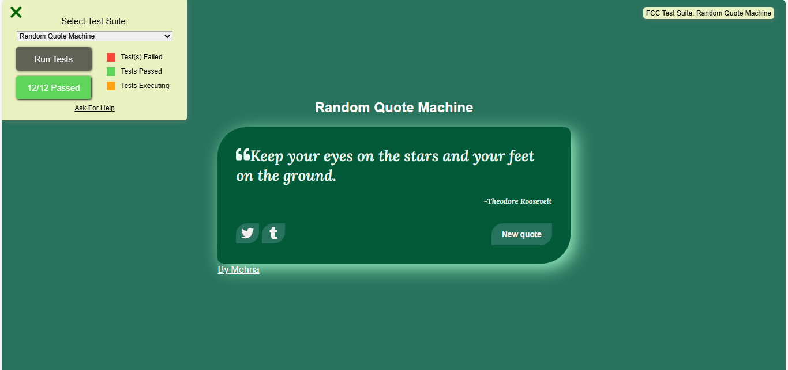
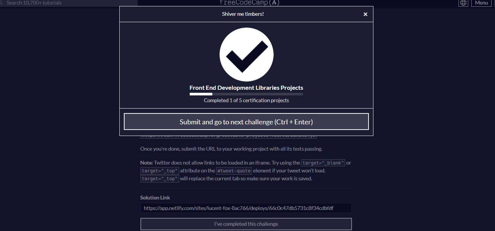

# Random Quote Machine 🚀

## Project Description 📝
The Random Quote Machine is a web application built using React.js that generates and displays random quotes. Users can click a button to generate a new random quote and can also share the current quote on Twitter.

> By creating this project using react js i learn alot about react js and how to use in projects ✨

## Demo 📸

 
 [Live-link](https://random-quote-section--graceful-druid-8b014e.netlify.app/)

## Technologies Used 🛠️

- React.js
- JavaScript
- HTML
- CSS

## Features ⭐

- Fetches random quotes from an API and displays them on the screen
- Allows users to generate a new random quote with a single click
- Provides a "Tweet" button that allows users to share the current quote on Twitter
- Responsive design that works well on both desktop and mobile devices

## Author 👩‍💻
- Website: [website.com](https://random-quote-section--graceful-druid-8b014e.netlify.app/)
- LinkedIn: [Mehria saqibi](https://www.linkedin.com/in/mehria-saqibi-a386a41a1?utm_source=share&utm_campaign=share_via&utm_content=profile&utm_medium=android_app)
- Email: [email](mosawermh@gmail.com)

## Contributing 🤝

Contributions are welcome! If you'd like to contribute, please fork the repository and create a pull request. Ensure that your code follows the project's coding standards and guidelines.
